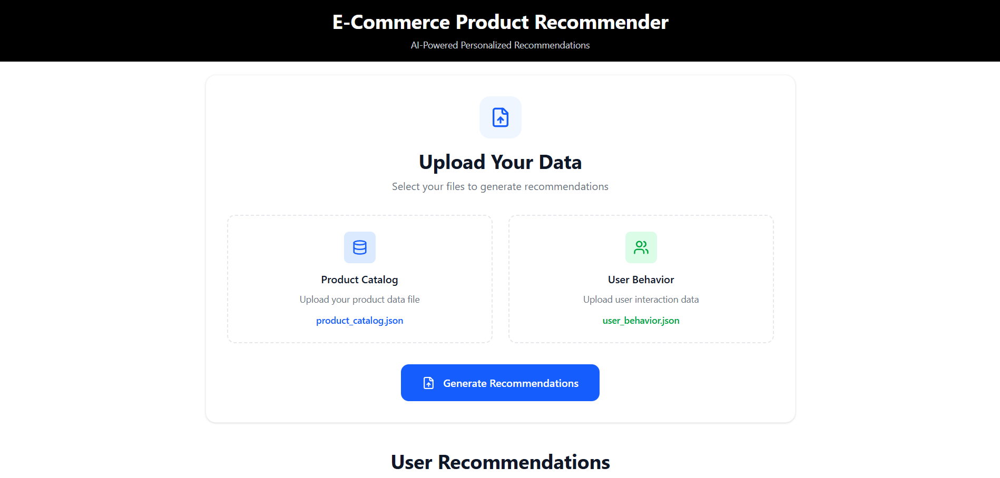
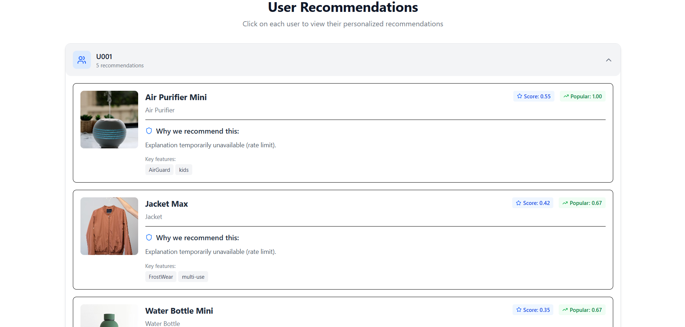

# ⚛️ React Application

### 📁 Project Structure
```
frontend/
├── public/
│   ├── index.html
│   └── favicon.ico
├── src/
│   ├── components/
│   │   ├── RecommendationPanel/
│   │   │   ├── RecommendationPanel.jsx
│   │   │   ├── RecommendationCard.jsx
│   │   │   └── PanelHeader.jsx
│   │   ├── FileUpload/
│   │   │   ├── FileUpload.jsx
│   │   │   └── UploadProgress.jsx
│   │   └── UI/
│   │       ├── LoadingSpinner.jsx
│   │       ├── ErrorBoundary.jsx
│   │       └── FallbackImage.jsx
│   ├── services/
│   │   ├── api.js          # API communication
│   │   └── storage.js      # Local storage management
│   ├── hooks/
│   │   ├── useRecommendations.js
│   │   └── useFileUpload.js
│   ├── utils/
│   │   ├── constants.js
│   │   └── helpers.js
│   ├── assets/
│   │   ├── preview-1.png   # Main dashboard view
│   │   ├── preview-2.png   # Recommendation details
│   │   └── product.jpeg    # Fallback product image
│   └── styles/
│       ├── main.css
│       └── components.css
```

### 🛠️ Setup & Installation

1. **Install Dependencies**
   ```bash
   npm install
   ```

2. **Environment Configuration**
   ```bash
   cp .env.example .env
   ```
   Configure:
   - `REACT_APP_API_URL`: Backend API base URL
   - `REACT_APP_DEBUG`: Enable debug mode

3. **Start Development Server**
   ```bash
   npm start
   ```

### 🎯 Components

#### RecommendationPanel
- Expandable/collapsible user recommendation sections
- Displays product cards with images, scores, and explanations
- Handles user interactions (likes, wishes)

#### FileUpload
- Drag-and-drop file upload interface
- Supports CSV and JSON formats
- Progress indicators and validation

#### UI Components
- **LoadingSpinner**: Async operation indicators
- **ErrorBoundary**: Graceful error handling
- **FallbackImage**: Placeholder for missing product images

### 🔧 Key Features

- **Responsive Design**: Mobile-first approach
- **Real-time Updates**: Live recommendation loading
- **Error Handling**: User-friendly error messages
- **Performance**: Optimized re-renders and API calls
- **Debug Mode**: Console logging for development

### 🚦 Scripts

- `npm start` - Development server
- `npm build` - Production build
- `npm test` - Run test suite
- `npm run lint` - Code linting

---

## 📸 Application Screenshots

### Main Dashboard - File Upload Interface

*The main dashboard showing the file upload interface with dual file input areas for product catalog and user behavior data. Features clean, modern design with drag-and-drop zones and clear visual feedback.*

### User Recommendations View

*Expanded recommendation panel showing personalized product suggestions for a specific user. Includes product images, AI-generated explanations, relevance scores, and interactive elements in a card-based layout.*

---

## 🎨 UI/UX Features

### Visual Design
- **Clean Interface**: Minimalist design with ample white space
- **Intuitive Navigation**: Clear visual hierarchy and interactive elements
- **Consistent Branding**: Cohesive color scheme and typography
- **Responsive Layout**: Adapts seamlessly from mobile to desktop

### User Experience
- **Progressive Disclosure**: Expandable panels to manage information density
- **Instant Feedback**: Real-time validation and loading states
- **Accessible Design**: Proper contrast and keyboard navigation support
- **Error Recovery**: Graceful handling of missing images and data

### Interactive Elements
- **File Upload**: Visual feedback during file selection and processing
- **Expandable Cards**: Smooth animations for panel expansion
- **Hover States**: Subtle interactions for better usability
- **Loading Indicators**: Clear progress feedback during operations

---

## 📱 Responsive Breakpoints

| Screen Size | Layout | Features |
|-------------|--------|----------|
| **Mobile** (< 768px) | Stacked | Compact cards, vertical layout |
| **Tablet** (768px - 1024px) | Hybrid | Medium cards, beginning side-by-side |
| **Desktop** (> 1024px) | Side-by-side | Full detail view, horizontal layout |

---

## 🔄 Data Flow Visualization

```
User Interface → API Calls → State Management → UI Updates
     ↓               ↓             ↓              ↓
File Upload   →  Backend API → Recommendations → Render
     ↓               ↓             ↓              ↓
Progress Bar   Loading States  Data Processing  Results Display
```

The application provides a seamless end-to-end experience from data upload to personalized recommendation delivery, with clear visual feedback at every step.